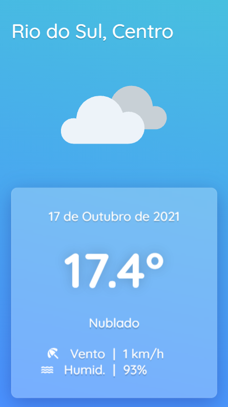
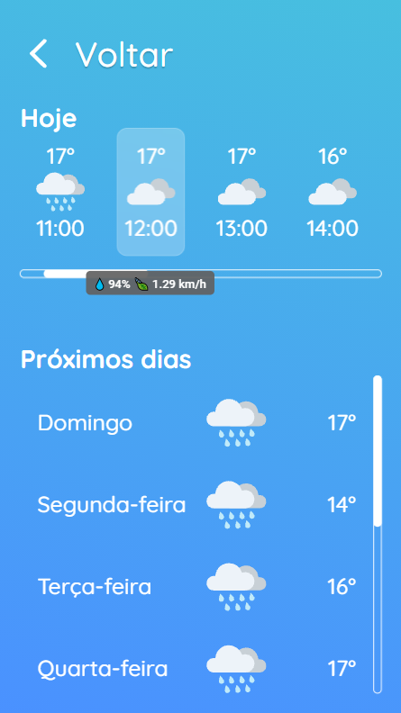
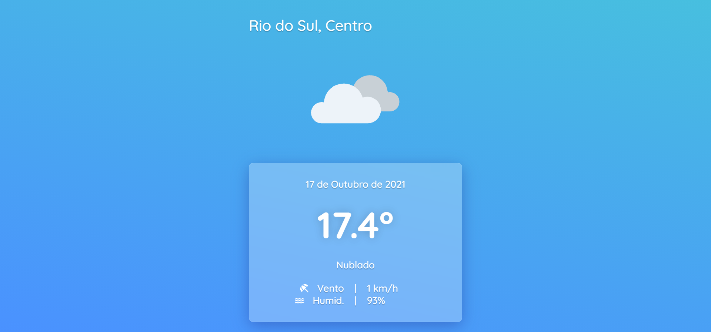
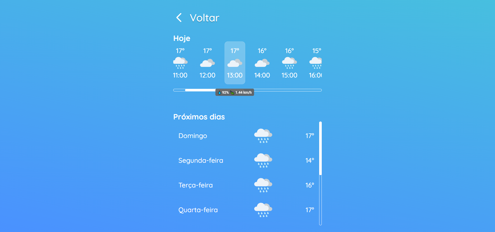

<h1 align="center">⛅ React Weather Forecast</h1>

- [English documentation](#english-documentation)
- [Documentação em português](#documentação-em-português)

____
# English Documentation
## 📜 Table of content
<!--ts-->
- [About the project](#-about-the-project)
- [Front-end](#front-end)
	- [Layout](#-layout)
	- [Features](#-features)
	- [Technologies](#-technologies)
- [Back-end](#back-end)
- [Full stack](#full-stack)
- [Inspirations](#-inspirations)
- [Live demo](#-live-demo)
- [Author](#-author)
<!--te-->
 
## 💻 About the project

This is a **weather forecast** application, that delivers a simple, clean and minimalist layout, projected for desktop and phone screens. This app was built using *React* and *Node*. The current repository/documentation explanate about the **front-end** section of this project, however, you can also check out the [back-end](#-back-end) and [full stack](#-full-stack) repositories.

The main goal with this project was to **release a simple yet complete** weather forecast app. In a way that I couldn't over engineer it or put way too much time on it, I decided to release the application at it's current state. In conclusion, for now I consider the **Weather Forecast** completed, but a more features could be added later on.

##  Front-end

### 📐 Layout
#### Mobile

	
	

#### Desktop

	
	

### 🔎 Features

This application obtains user's current location and fetches an API that retrieves the following data:
- User's current city and district through reverese geolocation
- Current weather conditions, like temperature, wind speed and humidity
- Detailed weather forecast for the current date
- Minimal and maximum temperature for the next days

### 🔨 Technologies

The following techlogies were used to build Weather Forecast:
- [Material UI](https://mui.com/)
- [Axios](https://github.com/axios/axios)
- [React Loading Skeleton](https://www.npmjs.com/package/react-loading-skeleton)
- [React Router Dom](https://www.npmjs.com/package/react-router-dom)

##  Back-end
The back-end section of **Weather Forecast** was built with NodeJs. You can read more about it on its own [GitHub repository](https://github.com/livramatheus/weather-forecast-back).

##  Full Stack
You can also check out the front and back-end sections of **Weather Forecast** bundled in a single [GitHub repository](https://github.com/livramatheus/weather-forecast).

### 😁 Inspirations

Weather Forecast was inspired by the following projects on Figma:
- [Weather Icons | Flat & Outline](https://www.figma.com/community/file/955978734883254712)
- [Weather Forecast App](https://www.figma.com/file/fXpD0piPYygazRk9mAXQH9/Weather-Forecast-App-(Community))

### 🌐 Live demo

Check out this project running on [Netlify + Heroku](https://livramento-weather.netlify.app/)

Edit this app on CodeSandbox.

### 👩‍🦲 Author
Full stack developed by **Matheus do Livramento**.

[GitHub](https://github.com/livramatheus) | [LinkedIn](https://www.linkedin.com/in/matheus-livramento-623590209/)

____
# Documentação em português
## 📜 Tabela de conteúdo

<!--ts-->
- [Sobre o projeto](#-sobre-o-projeto)
- [Front-end](#front-end-br)
	- [Funcionalidades](#-funcionalidades)
	- [Layout](#layout-br)
	- [Tecnologias](#-tecnologias)
- [Back-end](#back-end-br)
- [Full stack](#full-stack-br)
- [Inspirações](#-inspirações)
- [Demonstração](#-demonstração)
- [Autor](#-autor)
<!--te-->

## 💻 Sobre o projeto 

Este é um aplicativo de **previsão do tempo**, que oferece um layout simples, limpo e minimalista, projetado para telas de desktops e de dispositivos móveis. Este aplicativo foi desenvolvido usando *React* e *Node*. O presente repositório / documentação discorre sobre a seção **front-end** deste projeto, no entanto, você também pode verificar os repositórios do [back-end](#-back-end) e [full stack](#-full-pilha).

O principal objetivo com este projeto era de **lançar um aplicativo de previsão do tempo simples, mas completo**. De uma forma que eu não projetasse demais ou não dedicasse muito tempo em cima do mesmo, decidi liberar o aplicativo em seu estado atual. Concluindo, por agora considero **Weather Forecast** finalizado, mas mais recursos poderiam ser  adicionados mais tarde.

## Front-end

### 🔎 Funcionalidades

Este aplicativo obtém a localização atual do usuário e busca uma API que recupera os seguintes dados:
- Cidade e bairro atuais do usuário por meio de *reverese geolocation*
- Condições climáticas atuais, como temperatura, velocidade do vento e umidade
- Previsão meteorológica detalhada para a data atual
- Temperatura mínima e máxima para os próximos dias

### 📐 Layout
#### Mobile

	
	

#### Desktop

	
	

### 🔨 Tecnologias 

As seguintes tecnologias foram empregadas para construir **Weather Forecast**:
- [Material UI](https://mui.com/)
- [Axios](https://github.com/axios/axios)
- [React Loading Skeleton](https://www.npmjs.com/package/react-loading-skeleton)
- [React Router Dom](https://www.npmjs.com/package/react-router-dom)

## Back-end
A seção back-end do **Weather Forecast** foi desenvolvida com NodeJs. Você pode obter mais informações em seu respectivo [reposítorio do GitHub](https://github.com/livramatheus/weather-forecast-back).

## Full Stack
Você também pode verificar as seções front e back-end de **Weather Forecast** agrupadas em um único [repositório do GitHub](https://github.com/livramatheus/weather-forecast).

### 😁 Inspirações

**Weather Forecast** teve como inspiração os seguintes projetos no Figma:
- [Weather Icons | Flat & Outline](https://www.figma.com/community/file/955978734883254712)
- [Weather Forecast App](https://www.figma.com/file/fXpD0piPYygazRk9mAXQH9/Weather-Forecast-App-(Community))

### 🌐 Demonstração

Confira este projeto rodando em [Netlify + Heroku](https://livramento-weather.netlify.app/)

Edite este app no CodeSandbox.

### 👩‍🦲 Autor
Full stack desenvolvido por **Matheus do Livramento**.

[GitHub](https://github.com/livramatheus) | [LinkedIn](https://www.linkedin.com/in/matheus-livramento-623590209/)
